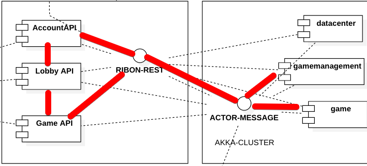

# ACCOUNT API

## AccountAPI PreView

APILIST:
- GET /account/{authToken}
- PUT /account/playMoney/{authToken}
- GET /preferences/{preferenceType}/{authToken}
- PUT /preferences/{preferenceType}/{authToken}
- GET/message/{messageType}/{messageId}/{clientType}/{authToken}
- PUT /fingerprint/{authToken}
- PUT /checkProfile/{authToken}
- GET /bannedWords
- GET /settings
- GET /operatorProfile
- GET /tournamentCustomType
- GET /banners
- GET /bonus/feature
- GET /bonus/indicator/{authToken}
- GET /bonus/active/{authToken}
- GET /bonus/available/{authToken}
- GET /bonus/{bonusId}/details/{authToken}
- PUT /bonus/{bonusId}/{action}/{authToken}
- PUT /bonus/{bonusId}/move/{direction}/{authToken}
- GET /hh/{gameFormat}/{authToken}
- GET /hh/{gameFormat}/{handId}/{authToken}
- POST /logging/client/{logType}/{authToken}
