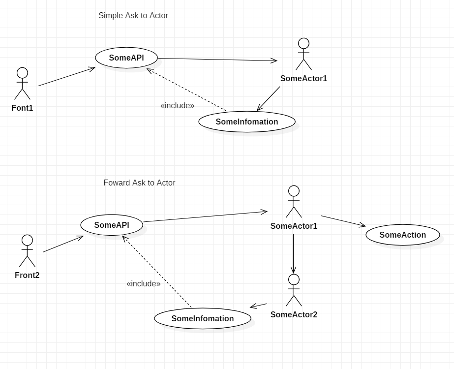

# AKKA

# Akka Remote

RemoteActor works similarly to LocalActor and is scalable.

more info : https://getakka.net/articles/Remoting/ - It is described in .net code, but it is the same as the concept of java.

related src:
- [accountapi/actor](accountapi/src/main/java/com/webnori/psmon/cloudspring/accountapi/actor)
- [accountapi/config](accountapi/src/main/resources/application.conf)
- [lobbyapi/actorTest](lobbyapi/src/test/java/com/webnori/psmon/cloudspring/lobbyapi/actor)

## Actor Config for Remote

    akka {
      actor {
        provider = remote
      }
      remote {
        enabled-transports = ["akka.remote.netty.tcp"]
        netty.tcp {
          hostname = "0.0.0.0"
          port = 2552
        }
      }
    }

## RemoteTest
    @Test
    public void testIt() {
        new TestKit(system) {{
            ActorRef probe = getRef();
            ActorSelection accountGreeter =
                    system.actorSelection("akka.tcp://accountapi@0.0.0.0:2552/user/greeter");

            accountGreeter.tell(new CMD_REMOTE(5,"hi"),getRef());
            String expectMessage = expectMsgClass(Duration.ofSeconds(5),CMD_REMOTE.class).getMessage();
        }};
    }

# Akka with DDD
Spring has a web total solution, and AKKA has a total solution for message processing. It may be a difficult attempt to harmonize the two things, but it will be a good experience and we will prepare some samples.

* [Akka-Actors-DomainDrivenDesign](https://www.infoq.com/articles/Reactive-Systems-Akka-Actors-DomainDrivenDesign)
* [Akka-Actors-DomainDrivenDesign](https://www.slideshare.net/Lightbend/using-the-actor-model-with-domaindriven-design-ddd-in-reactive-systems-with-vaughn-vernon)
* [SpringAkkaEventSourcing](https://mromeh.com/2018/04/27/spring-boot-akka-event-sourcing-starter-part-1/)
* [more](https://www.google.co.kr/search?newwindow=1&source=hp&ei=jQNCXIuxHYjhvASs1JmQAQ&q=spring+akka+ddd&btnK=Google+Search&oq=spring+akka+ddd)

