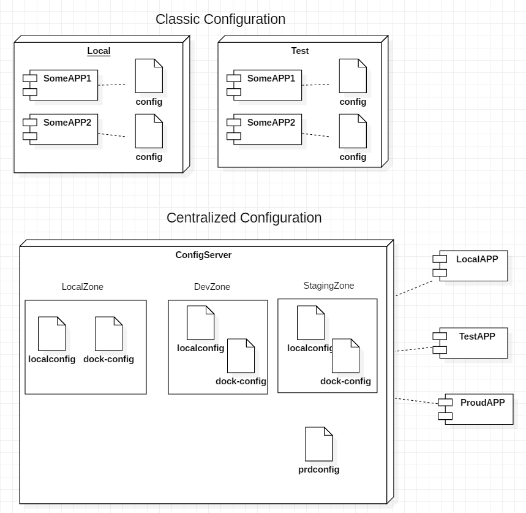

# Config Service

Centralizing and managing the settings used in an application has several advantages

It must be layered and managed.

default url :  http://localhost:8888

## Build By Docker
* build : docker build -t psmon.configservice .
* run : docker run --net psmonlocal --ip 172.18.1.1 -it -d -p 18888:8888 -e "SPRING_PROFILES_ACTIVE=dock-local" --name configservice psmon.configservice
* rerun : docker restart configservice 
* stop : docker stop configservice

## Documents(KOR):
* WIKI - http://wiki.webnori.com/display/webfr/Centralized+Configuration

 

