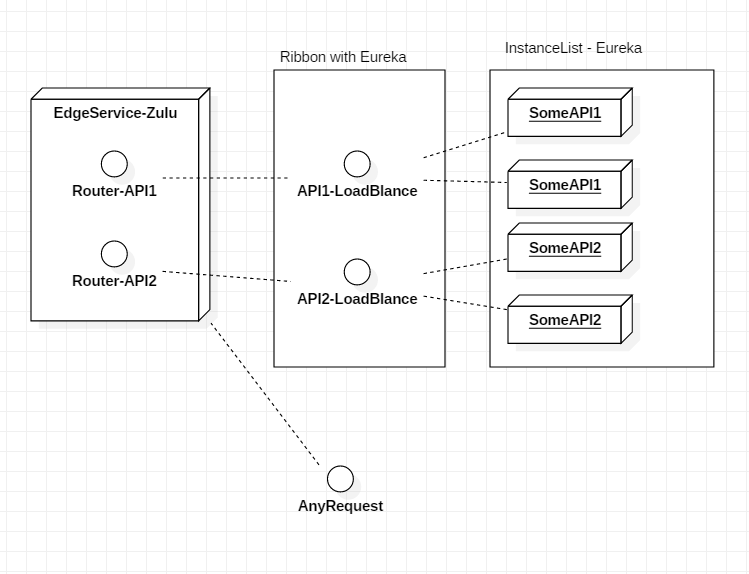

# Zulu Edge Service

## Dynamic LoadBlance in GateWay
* Zulu(Gateway) + Ribbon(LoadBlance) + Eureka(Discovery)

### Zulu Config

url : http://git.webnori.com/projects/SB2/repos/cloudconfig/browse/edgeservice.yml

    server:
      port: 8765
      
    zuul:
        prefix: /api
        routes:
            account:
                path: /account/**
                serviceId: accountapi
            lobby:
                path: /lobby/**
                serviceId: lobbyapi
            game:
                path: /game/**
                serviceId: gameapi            
    
    ribbon:
      eureka:
        enabled: true
