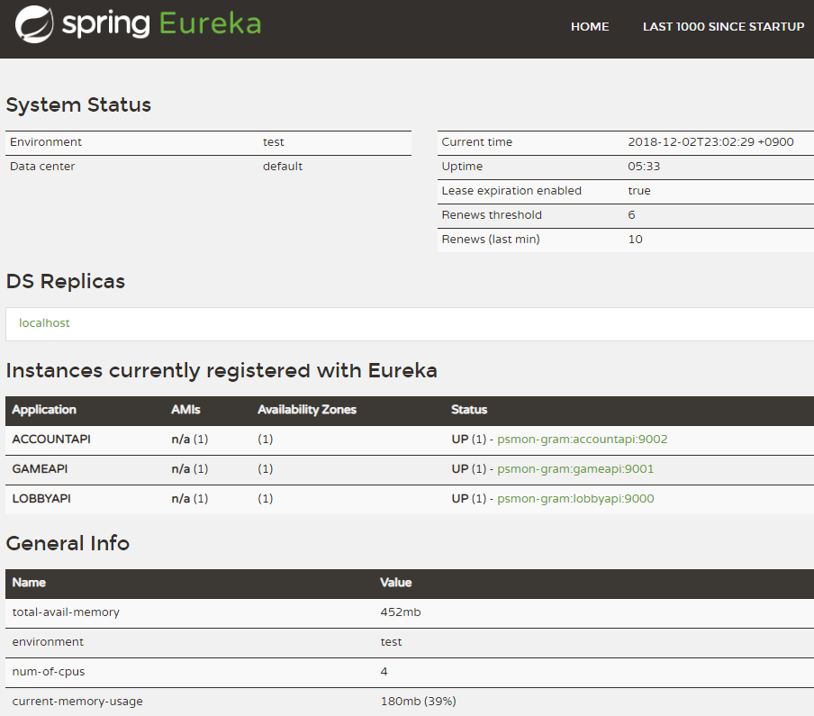
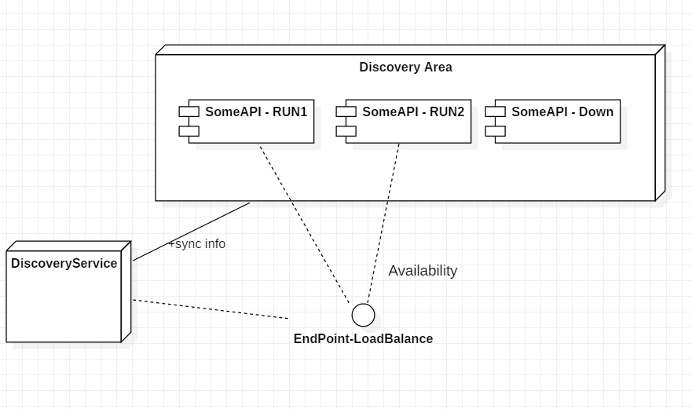
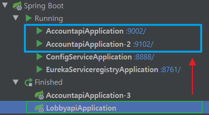

# Eureka

default url :  http://localhost:8761

This is how the normal Discovery Service works. The reason for this functionality in Micro Service is simple.
Let's say you want to increase and decrease the API flexibly during operation. The Discovery Service detects this and provides a flexible
You can continue to provide services to your users, which is useful even in the event of a disability. The node of the provided service suddenly goes down
Let's do it. The DiscoveryService will detect this and block access.

## Ribbon 

Service

    # Application in Account API
    @EnableDiscoveryClient
    @EnableFeignClients
    @SpringBootApplication
    public class AccountapiApplication {...}
    
    # Controller in Account API
    @GetMapping("/department/{departmentId}")
    public List findByDepartment(@PathVariable("departmentId") Long departmentId) {...}

Client

    # Client Interface in LobbyAPI
    @FeignClient(name = "accountapi")
    public interface AccountClient {
        @GetMapping("/demo/department/{departmentId}")
        List findByDepartment(@PathVariable("departmentId") String departmentId);
    }
    
    # Test 
    @Autowired
    AccountClient accountClient;
    
    List ribbonRuslt= accountClient.findByDepartment("1234");
    Assert.assertTrue(ribbonRuslt.size()>0);

We can call Rest, which is easily load balanced with a known application name.

## Etc - Discovery for AKKA
- https://developer.lightbend.com/docs/akka-management/current/discovery/index.html

## Documents(KOR):
* doc : http://wiki.webnori.com/display/webfr/Discovery+Service+-+Eureka)
