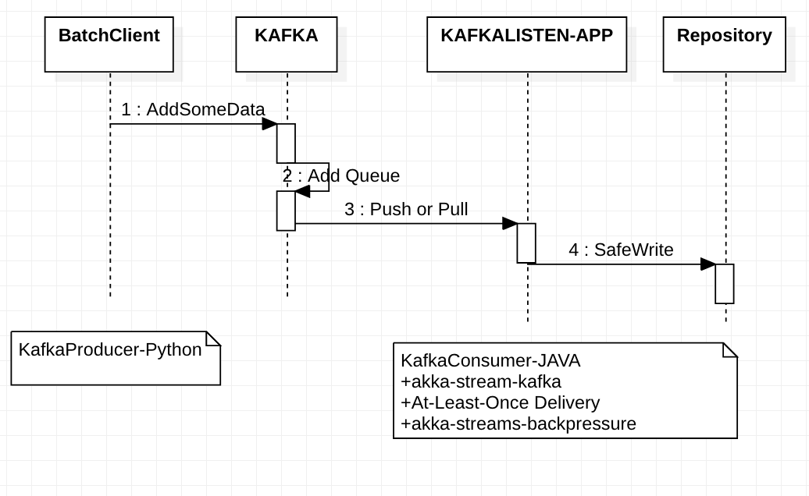

# Fast for Big Data

We will separate our snow data types as follows to implement different message usage strategies.
- RealTime Message for Service 
- BigData for Analysis
- FastData for Statistics

Type of Message
- Use netty to implement low-level message transfer. (Difficult to design distributed processing directly)
- Netty implements message transfer using the abstracted RemoteActor. (Built-in using AkkaCluster for dispersion treatment)
- Send a message using kafka (cluster configuration of the primary keeper is required for distributed processing and external)

## KAFKA

Pure Kafka are generally difficult to handle four things:
* Cluster
* guarantee message order
* guarantee message exactly-once
* Back pressure

Although Kafka can be used across the service level, 
the architecture is likely to complement Kafka's shortcomings.
So we will only use Kafka here for analysis or batch purposes.

### KAFKA Scope

### KAFKA with AKKA
- [atleastonce](https://doc.akka.io/docs/akka-stream-kafka/current/atleastonce.html)
- [transactions](https://doc.akka.io/docs/akka-stream-kafka/current/transactions.html)

### Streams

- AkkaStream

## SPARK

## ELastic Search
