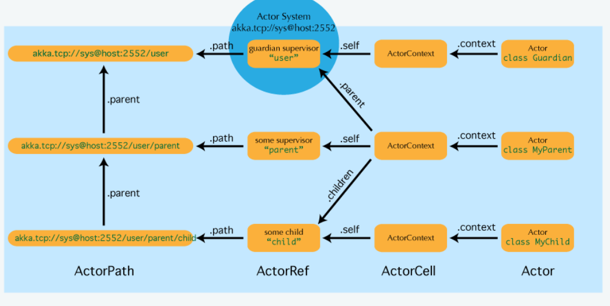

## Messaging with AKKA System

src:
* [Spring with AKKA](../accountapi/src/main/java/com/webnori/psmon/cloudspring/accountapi/config)
* [Message for Actor](../library/src/main/java/com/webnori/psmon/cloudspring/library/common/message)
* [Actor](../accountapi/src/main/java/com/webnori/psmon/cloudspring/accountapi/actor)
* [Create Actor](../accountapi/src/main/java/com/webnori/psmon/cloudspring/accountapi/AccountapiApplication.java)

How to send a message to an actor from another remote application

    ActorSelection remoteGreeter = system.actorSelection("akka.tcp://accountapi@127.0.0.1:2552/user/greeter");
    remoteGreeter.tell(new Greet("This is Remote Message"),ActorRef.noSender());

Akka Documents Summary:
1. [Local Actor](https://doc.akka.io/docs/akka/current/actors.html#actor-api)
2. [Remote Actor](https://doc.akka.io/docs/akka/current/remoting.html)
3. [Router](https://doc.akka.io/docs/akka/current/routing.html)
4. [Stream](https://doc.akka.io/docs/akka/current/stream/stream-flows-and-basics.html)
5. [Cluster](https://doc.akka.io/docs/akka/current/common/cluster.html#intro)
6. [Akka with Any Stream](https://developer.lightbend.com/docs/alpakka/current/)
