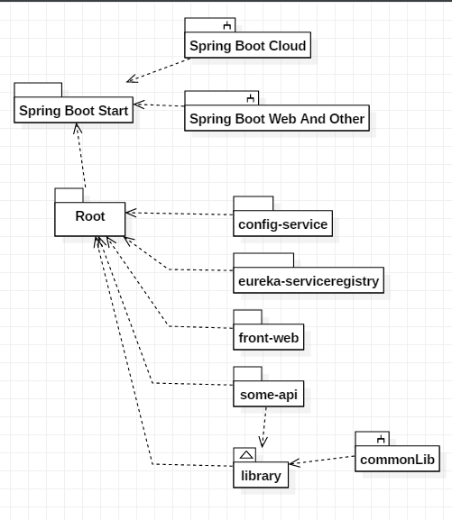
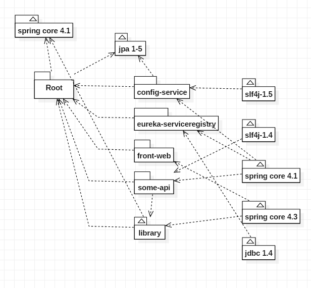

# Tools and Other Concept

## Dependency Goals

### Good

### Bad

## Deploy Goals
* Local for Allin-One Service
* DockerCompose in Local and Cloud for Test
* Kubernetes in Cloud for Proud
* Supports various environments through centralized setting - [more detail](../config-service)

## Docker-First Setting
* pre requered : install docker to your local com
* docker network create --driver bridge psmonlocal

## Mysql-FirstSetting
* docker pull mysql/mysql-server:5.6
* docker run --net psmonlocal --ip 172.18.1.10 -it -d -p 13306:3306 --name=mysql1 mysql/mysql-server:5.6
* docker logs mysql1 2>&1 | grep GENERATED
* GENERATED ROOT PASSWORD: Ik0MeP!ER2urm4JUKxyldEB@RoG
* docker exec -it mysql1 mysql -uroot -p
* mysql> ALTER USER 'root'@'localhost' IDENTIFIED BY 'Ik0MeP!ER2urm4JUKxyldEB@RoG';
* SET PASSWORD FOR 'root'@'localhost' = PASSWORD('root');
* GRANT ALL PRIVILEGES ON *.* TO 'root'@'%' IDENTIFIED BY 'root';
* FLUSH PRIVILEGES;

## Refrence Links

* [Links](links.MD) : Reference link

