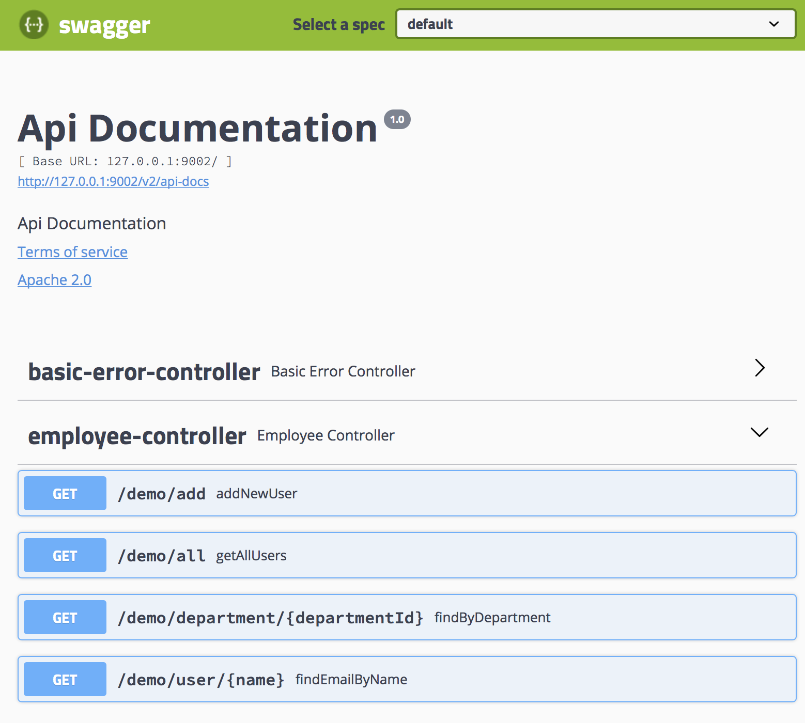

# Tools and Other Concept

## Dependency Goals

### Good

### Bad

### 
strategy:
* Simplified dependencies through spring boot -https://start.spring.io/
* Do not share entity. DB dependency sharing is a hurdle in micro-services.
* Share Only POJO in MicroServices. By restoring pure messages, We can play what we want. -CQRS,EventSourcing

## Deploy Goals
* Local for Allin-One Service
* DockerCompose in Local and Cloud for Test
* Kubernetes in Cloud for Proud
* Supports various environments through centralized setting - [more detail](../config-service)
* [Docker for this project](docker.md)

## Api Doc Automation

* [Swagger-ui.html](http://127.0.0.1:9000/swagger-ui.html) : All APIs support APIDOCUMENT automation.
* [swagger-2-documentation](https://www.baeldung.com/swagger-2-documentation-for-spring-rest-api)

## Refrence Links

* [Links](links.MD) : Reference link

