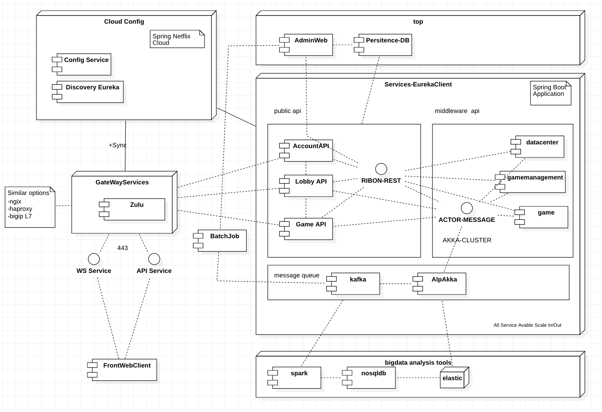
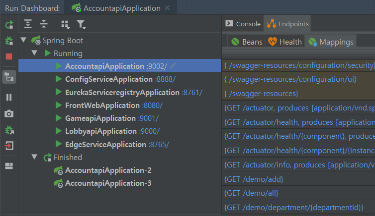
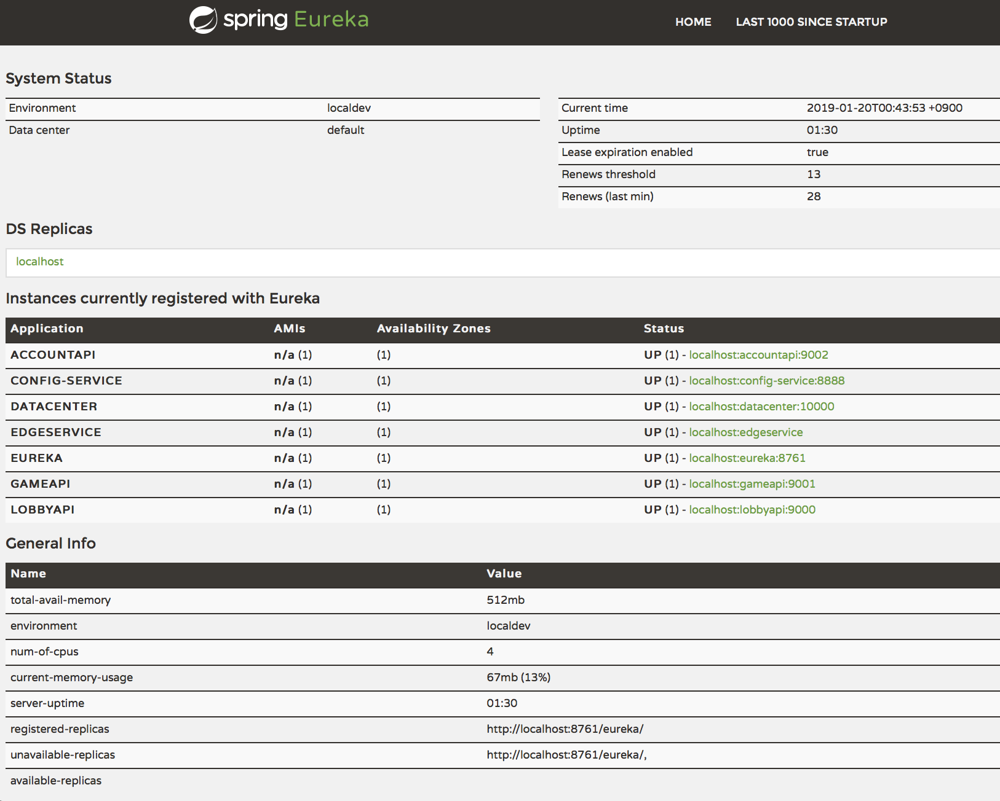

# Spring Cloud for Distributed applications

Spring Cloud를 이용하여 멀티플레이 가능한 게임시스템에 활용할수 있는 실제 작동가능한 아키텍트를  구성해 보았습니다.

글로벌 개발사,글로벌 게임서비스에 몸담고 있을때 작성된 토이프로젝트이며
구글링 영문수준이니 양해 해주세요  

## Goals
- Distributed Micro Game(or Other) Services Using Spring Cloud

    In the domain-driven design, the domain is first built and the infrastructure is next. However, 
    we are aiming to build a frame that can contain various microdomains.

Concept:
* Service Discovery : Eureka
* Gateway Service : Zulu
* Light Monitoring : Eureka + actuator
* Peer-to-peer: New nodes can contact existing peers, be notified about other peers, and fully integrate themselves into the network without any configuration changes.
* No single point of failure/bottleneck: multiple nodes are able to service requests, increasing throughput and fault-tolerance.
* Connect with other streams : alpakka

## Launch Order
* config-service
* eureka-serviceregistry
* edge-service
* your micro service
    
The information is automatically updated even if the sequence changes, but the config server must be in the initial state.

## Local Run
* FullBuild: root>mvn clean install
* AppRun: root/{APPPATH}> mvn spring-boot:run -Dspring.profiles.active="local"
* Recommend : Using Spring Dashboard

Profile for Local(Test for Cluster):
- EurekaServiceregistry(8765): local
- ConfigService(8888) : local
- AkkaCluster(6000-Seed) : local
- DataCenter(10000) : local-h2
- AccountApi1(9002) : local-h2
- AccountApi2(9102) : local-h3
- LobbyApi1(9200) : local-h2
- LobbyApi2(9201) : local-h3

    The same application can manage the same port when using a docker

Deployment goal:
- Run all locally without a docker
- Run locally through integration of the dockers
- Drive the docker directly to AWS
- Deliver to BareMetal without AWS

## Discovery Server

All micro-services are monitored and managed.
This is useful for how each application recognizes each other to create a strategy for how to dynamically distribute and respond to failures.

## Module
* [ConfigService](config-service) : Centerlized config - [Sample](/library/config-sample) -Sprint Cloud Config
* [DiscoveryService](eureka-serviceregistry) : Manage distributed applications -Spring Cloud Eureka
* [EdgeService](edge-service) : Dynamic LoadBlancer - Spring Cloud Zulu
* [libary](library) : Simple Depency(Only Shared POJO) and Third party Tools

## MicroService Sample - There is no domain goal here, but you can use the sample code to add new domain ideas and create services.
* [DataCenter](datacenter) : Distributed data aggregation, centralized service that can mapreduce the data of a distributed application
* [AccountAPI](accountapi) : Manage User account or items. - JPA or Native Query
* [LobbyAPI](lobbyapi) : Provide services beyond games, including navigating games and entering. - Rest and Websocket
* [GameAPI](gameapi) : Realtime messages are mainly processed. Services for playing games - Websocket with Actor
* [FrontWeb](front-web) : Modern web applications to be displayed to users -HTML5 with React

## UnitTestTools
A classic CRUD unit test requires a lot of code or is almost useless to reflect business logic. We will prepare various test tools to verify the actual business logic.

* [LobbyAPI-TestTools](lobbyapi/src/test)

## Fast Data
In our service, many messages and data will be generated, and we will acquire it quickly and deliver the data to various advanced analysis tools to try visualization. This is a concept opposite to long-cycle batch processing.

* [FastData](fastdata.md)

## MessageSystem in APP for Akka 

We use AKKA as a base and Akka Stream connect with other Stream(Kafka,RabbitMQ,ETC)
One of the characteristics of AkkaSystem is that we can embed message systems in our services.

* [Akka](library/akka.MD)

## Documents(KOR):
* WIKI - http://wiki.webnori.com/display/webfr/Spring+Cloud+MicroService

