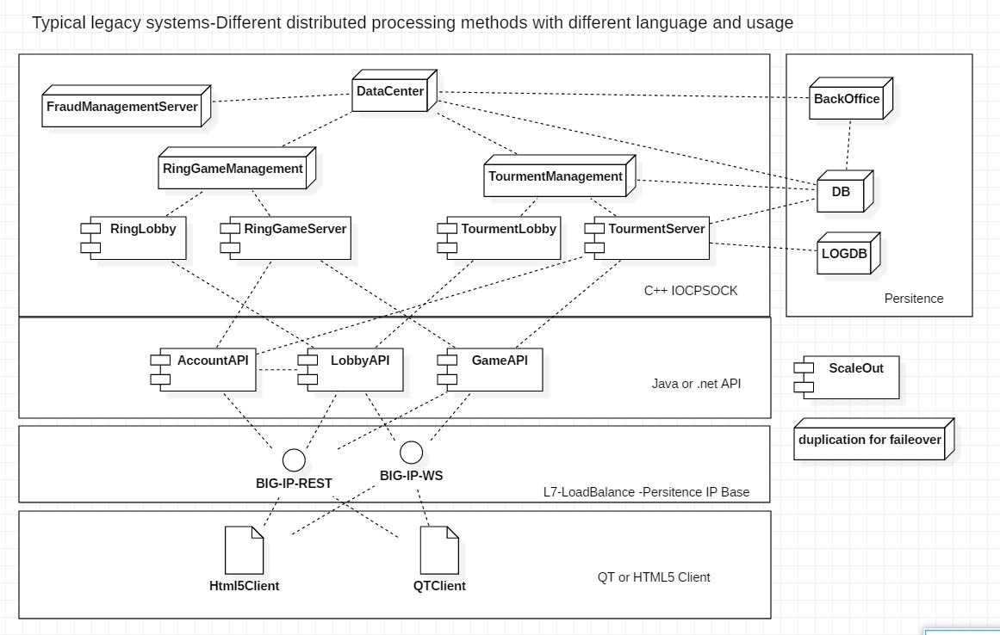

# Spring Cloud for Distributed applications

## Legacy System
It is part of a legacy service that has been configured and operated very long ago.

## Goal
Distributed Micro Game Services Using Spring Cloud

-It has tried to implement sample functions that can be applied in practice.

## Launch Order
* config-service
* eureka-serviceregistry
* edge-service
* your micro service
    
The information is automatically updated even if the sequence changes, but the config server must be in the initial state.

## Local Run
* FullBuild: root>mvn clean install
* AppRun: root/{APPPATH}> mvn spring-boot:run -Dspring.profiles.active="local"
* Recommend : Using Spring Dashboard

Active Spring Profile : local

## Docker Run
* BuildAndRun : {APPPATH}> dockbuild.cmd

## Kubernetes
* kubernetes/{APPNAME}.yaml

## Module
* [ConfigService](config-service) : Centerlized config - [Sample](/library/config-sample) -Sprint Cloud Config
* [DiscoveryService](eureka-serviceregistry) : Manage distributed applications -Spring Cloud Eureka
* [EdgeService](edge-service) : Dynamic LoadBlancer - Spring Cloud Zulu
* [libary](library) : Simple Depency (Common Lib Just have POJO or Manage Lib Dependency ) - Pure Ols Plain Java Object
* [Messaging](library/akka.MD) : We use AKKA as a base and Akka Stream connect with other Stream(Kafka,RabbitMQ,ETC)

## MicroService
* [AccountAPI](accountapi) : Manage User account or items. - JPA
* [LobbyAPI](lobbyapi) : Provide services beyond games, including navigating games and entering. - Rest and Websocket
* [GameAPI](gameapi) : Realtime messages are mainly processed. Services for playing games - Websocket with Actor
* [FrontWeb](front-web) : Modern web applications to be displayed to users -HTML5 with React

## UnitTestTools
* [LobbyAPI-TEST](lobbyapi/src/test) : UnitTestTools

## Fast Data
* [FastData](fastdata.md)

## Akka with DDD
* https://www.infoq.com/articles/Reactive-Systems-Akka-Actors-DomainDrivenDesign
* https://www.slideshare.net/Lightbend/using-the-actor-model-with-domaindriven-design-ddd-in-reactive-systems-with-vaughn-vernon
* https://mromeh.com/2018/04/27/spring-boot-akka-event-sourcing-starter-part-1/
* 
## Documents(KOR):
* WIKI - http://wiki.webnori.com/display/webfr/Spring+Cloud+MicroService

